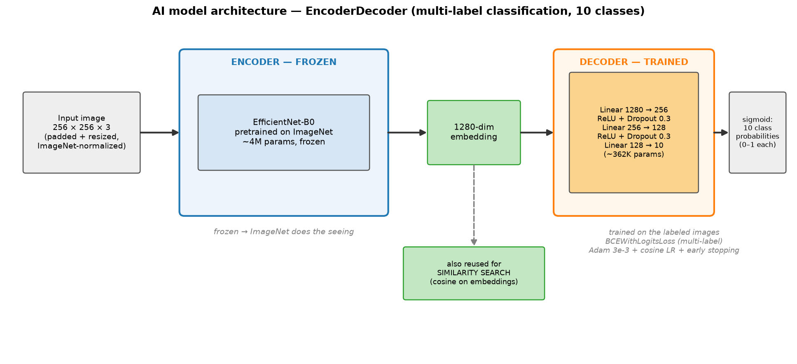
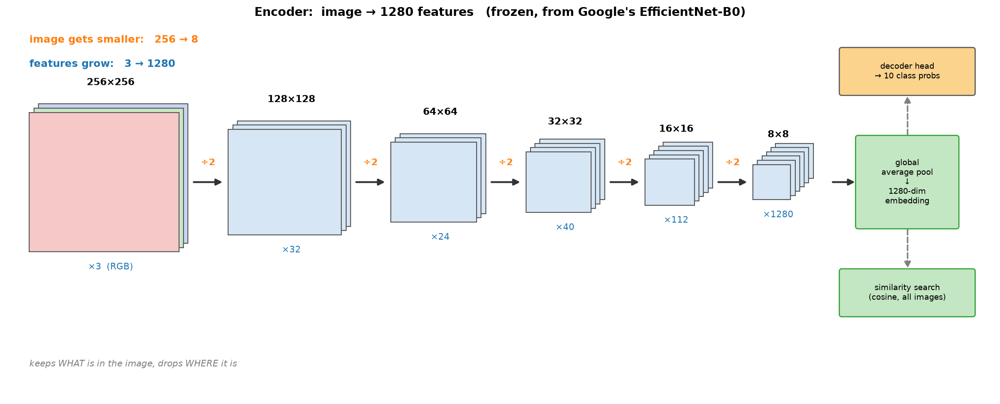
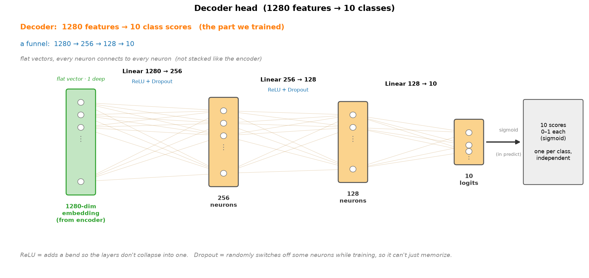
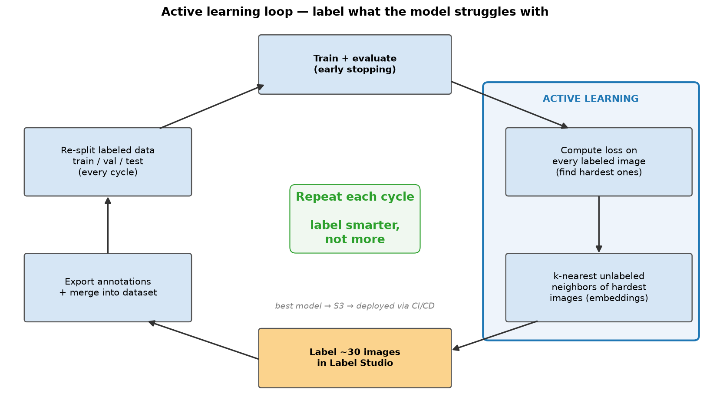
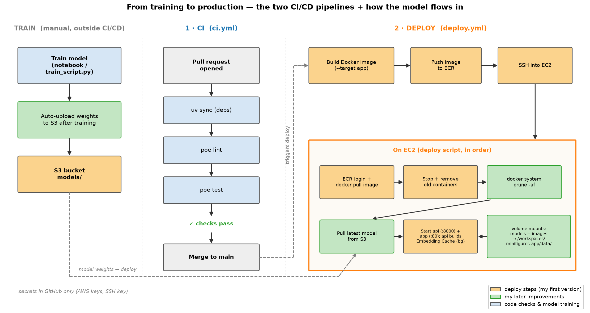

<div align="center">

# Machine Learning (Computer Vision) and Active Learning

### An end-to-end computer vision product — from labelling to production

*A multi-label image classifier and visual similarity search for minifigure images, trained with an active-learning loop in Label Studio, served by FastAPI and Streamlit, and deployed to AWS with Docker, Terraform and GitHub Actions.*

[](https://github.com/MRafiqAsim/MachineLearning_ComputerVision_ActiveLearning/actions/workflows/ci.yml)
[](pyproject.toml)
[](src/minifigures_model/model.py)
[](https://github.com/astral-sh/uv)

</div>

---

## What it does

- **Tags images with attributes** — a multi-label classifier predicts 10 attributes per image: `alien`, `human`, `robot`, `cape`, `glasses`, `hat`, `helmet`, `angry`, `happy`, `facial hair`.
- **Finds visually similar items** — the same network's image embeddings power a cosine-similarity search ("customers also viewed").
- **Learns from few labels** — an active-learning loop asks you to label the images the model struggles with most, instead of labelling everything.
- **Runs as a product** — a FastAPI backend and a Streamlit catalogue, packaged in one Docker image and deployed to AWS by CI/CD.

## Architecture


The Streamlit app talks to the FastAPI service over REST. The API loads the trained model, predicts attributes for uploaded images and answers similarity queries from an embedding cache built at startup. Both run as containers from a single image on EC2; trained models are pulled from S3 at deploy time.

### Model



A pretrained **EfficientNet-B0** encoder (frozen, ImageNet weights) turns each 256 × 256 image into a 1280-dimensional embedding. A small trained decoder head (`1280 → 256 → 128 → 10`, ReLU + dropout) outputs one sigmoid probability per attribute, trained with `BCEWithLogitsLoss`, Adam, cosine learning-rate decay and early stopping. The embedding is reused for similarity search.

<details>
<summary>Encoder and decoder in detail</summary>




</details>

### Active learning



Each cycle trains the model, computes the loss on every labeled image to find the hardest ones, and looks up their nearest unlabeled neighbours in embedding space. Those neighbours get the highest priority in Label Studio, so each labelling round of ~30 images targets exactly what the model gets wrong. New labels are merged into the training split only, keeping validation and test sets frozen for honest comparisons.

### CI/CD



- **CI** (`ci.yml`) — on every push and pull request: dependency sync, lint (pre-commit with ruff) and tests.
- **Deploy** (`deploy.yml`) — on merge to `main`: build the image, push it to ECR, then SSH into EC2 to pull the latest model from S3 and restart the API and app containers.

## Tech stack

| Area | Tools |
|---|---|
| Model | PyTorch, torchvision (EfficientNet-B0), scikit-learn (nearest neighbours) |
| Labelling | Label Studio, active learning on embedding neighbours of high-loss images |
| Serving | FastAPI, Streamlit |
| Packaging | uv, Poe the Poet, Docker (multi-stage) |
| Infrastructure | Terraform on AWS: EC2, ECR, S3, IAM, optional Route 53 |
| Quality | pytest + coverage, ruff, pre-commit, GitHub Actions |

## Getting started

The project targets **Linux** (the pinned CPU PyTorch wheels are Linux-only). The easiest way to run it is the included **devcontainer** — open the repository in GitHub Codespaces or VS Code *Reopen in Container* — which installs everything with uv. Run `poe` to list all tasks.

### 1. Get the data

```bash
poe fetch_data      # downloads the public dataset and converts it to data/data/
```

This creates `data/data/minifigures/*.png` (450 images of 37 minifigures), `catalog.json` (names and LEGO sets) and an empty `dataset.json` for your labels. The images are not stored in this repository.

**Using your own images instead:** put PNG files in `data/data/minifigures/` — the file name (without `.png`) is the image's tag — and start with `{}` in `data/data/dataset.json`.

### 2. Label a first batch in Label Studio

```bash
export LABEL_STUDIO_LOCAL_FILES_SERVING_ENABLED=true
export LABEL_STUDIO_LOCAL_FILES_DOCUMENT_ROOT="$PWD/data"
label-studio start --port 8080
```

Create a project and paste [`src/labeling/project_config.xml`](src/labeling/project_config.xml) as the labelling interface. Connect the images as **local storage** (*Settings → Cloud Storage → Add Source Storage → Local files*, path `…/data/data/minifigures`) — the active-learning step relies on it — and add `data/annotations` as target storage. Label a first batch (a few dozen images), sync the target storage, then convert the annotations:

```bash
python src/labeling/export_annotations.py    # -> data/data/dataset_labeled.json
```

Merge the result into `data/data/dataset.json` — the file maps each image tag to its list of attributes, e.g. `{"spider-man_001": ["human", "happy"]}`.

### 3. Train

```bash
poe train           # python src/minifigures_model/train_script.py --tag my_model
```

The best model by validation F1 is saved to `data/models/my_model/`. Set `MODEL_TAG` to serve a model with a different name.

### 4. Run the active-learning loop

```bash
export LABEL_STUDIO_TOKEN=...       # Label Studio > Account & Settings > Access Token
export LABEL_STUDIO_PROJECT_ID=1    # the number in the project URL
export AL_MODEL_VERSION=model_v1    # a new name for every round
python src/labeling/active_learning.py
```

Label Studio now ranks unlabeled images by how much they would help. Label the top ~30, export, merge (`src/labeling/merge_labels_train_only.py` keeps validation and test frozen), retrain — and repeat. The [`review_labels`](notebooks/review_labels.ipynb) notebook shows every labelling batch side by side.

### 5. Serve

```bash
poe api --dev       # FastAPI on http://localhost:8000 (interactive docs at /)
poe app             # Streamlit on http://localhost:8500
```

| Endpoint | Purpose |
|---|---|
| `POST /predict/image/` | Attribute probabilities for an uploaded image |
| `GET /predict/similar/?tag=…&k=5` | The *k* most similar catalogue images |
| `GET /data/get_image_tags/` · `GET /data/get_image/?tag=…` | Browse the catalogue |

## Deploy to AWS

```bash
cd terraform
terraform init
terraform apply -var="ec2_key_pair_name=<your-key-pair>"
```

Terraform creates the EC2 host (with Docker), an ECR repository, an S3 bucket for models, the IAM role that lets the host read both, and — if you set `route53_zone_name` — a DNS record. Upload a trained model with `MODELS_BUCKET=<bucket> poe train`, or copy `data/models/` and `data/data/` to the bucket's `models/` and `data/` prefixes.

To enable the deploy workflow, add these to the repository settings (values come from `terraform output`):

| Type | Name |
|---|---|
| Variable | `DEPLOY_ENABLED` = `true`, `AWS_REGION`, `ECR_REGISTRY`, `ECR_REPOSITORY`, `EC2_HOST`, `MODELS_BUCKET` |
| Secret | `AWS_ACCESS_KEY_ID`, `AWS_SECRET_ACCESS_KEY`, `EC2_SSH_KEY` |

## Project structure

```
src/
├── minifigures_model/     # dataset, EncoderDecoder model, metrics, train / validate / evaluate, train_script.py
├── minifigures_api/       # FastAPI app: prediction, similarity and data routers
├── minifigures_app/       # Streamlit catalogue: home, product and market pages
└── labeling/              # dataset preparation, Label Studio export / merge, active learning
notebooks/                 # label review notebook
terraform/                 # AWS infrastructure (app-stack module)
tests/                     # pytest suite
assets/                    # diagrams
```

## Development

```bash
uv sync --all-groups
pre-commit install
poe lint
poe test
```

## Dataset and credits

The default dataset is **[LEGO Minifigures](https://www.kaggle.com/datasets/ihelon/lego-minifigures-classification)** by the TinySets development team (Yaroslav Isaienkov), licensed under **[CC BY 4.0](https://creativecommons.org/licenses/by/4.0/)**. `poe fetch_data` downloads it and converts the images to PNG under new file names; the images are not redistributed in this repository. LEGO® is a trademark of the LEGO Group, which does not sponsor or endorse this project.

## Support

Found this useful? Help fuel the next release with a [coffee (€5)](https://paypal.me/mrafiq89/5EUR) ☕ — or leave a ⭐ so others can find it too.

---

Shared as a portfolio project. No open-source license is granted for the code; please get in touch before reusing it.
